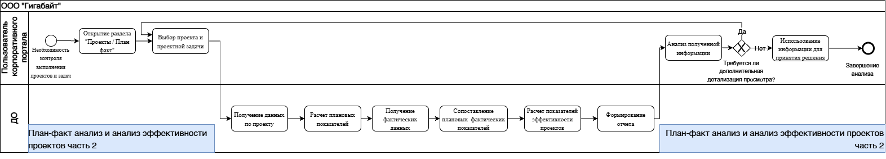
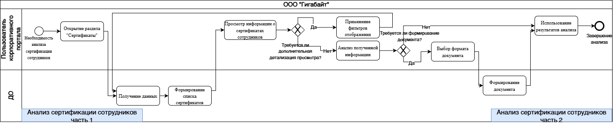
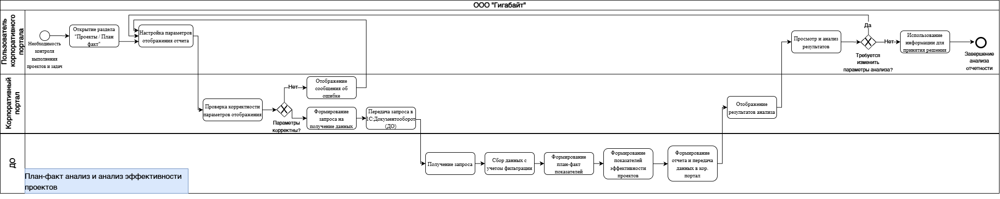
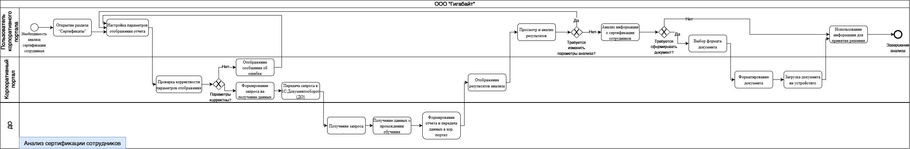

# Оптимизация подсистемы «Отчетность и аналитика» (ООО «Гигабайт»)

**Роль:** Младший системный аналитик (Практика)\
**Цель:** Оптимизация бизнес-процессов формирования отчетности и разработка функциональных требований для обновления корпоративного портала на базе 1С.

## Описание проекта и проблематика
**ООО «Гигабайт»** использует корпоративный портал для внутреннего управления. Однако работа с аналитическим модулем стала узким местом как для пользователей, так и для инфраструктуры. 

В ходе первичного аудита были выявлены две фундаментальные проблемы:
1. **Отсутствие предварительной фильтрации:** при запросе отчета система выгружала весь массив данных из БД, а фильтрация происходила уже на стороне клиента. Это приводило к долгим зависаниям интерфейса. 
2. **Высокая доля ручного труда:** подготовка отчетов требовала 100% ручной выгрузки и форматирования данных. 

Мне предстояло спроектировать новое, оптимизированное решение.

---

## Шаг 1. Анализ процессов и проектирование целевой архитектуры (BPMN)
Чтобы локализовать узкие места, было принято решение начать с формализации текущих процессов. Было смоделировано **5 ключевых бизнес-процессов в состоянии "AS-IS"** (анализ загрузки сотрудников, план-факт, компетенции, обучение, сертификация). Анализ наглядно показал слияние логики фильтрации и логики получения данных. Ниже представлены несколько бизнес-процессов в состоянии AS-IS.

> 📁 **Модель процесса анализа эффективности проектов и план-факт анализ (AS-IS) **\
\
> 📁 **Модель процесса анализа сертификации сотрудников (AS-IS)  **\

Отталкиваясь от этого, были разработаны **5 целевых моделей "TO-BE"**. В их основу легла новая трехуровневая архитектура с внедрением этапа *предварительной валидации*.
* Теперь пользователь *до* отправки запроса настраивает параметры в UI.
* Уровень контроллера (в 1С:Документооборот) проверяет эти параметры. 
* **Бизнес-эффект:** Это архитектурное изменение позволяет отсекать **100% некорректных запросов** до обращения к базе данных, что, по предварительным оценкам, снизит нагрузку на серверную часть на **30-40%**. Также в TO-BE модель был заложен шаг автоматической фоновой генерации готовых файлов, что полностью исключает ручной труд при подготовке к совещаниям.

> 📁 **Модель процесса анализа эффективности проектов и план-факт анализ (TO-BE)**\
\
> 📁 **Модель процесса анализа сертификации сотрудников (TO-BE)**\

---

## Шаг 2. Разработка структуры данных (ER-модель)
Переход к гибкой серверной фильтрации, заложенной в моделях TO-BE, потребовал четкого понимания того, какими данными мы оперируем.

Для реализации новых сценариев (например, когда HR-менеджеру нужно отфильтровать базу только по сотрудникам с действующим сертификатом "1С:Специалист"), я провела анализ предметной области и спроектировал логическую структуру данных. 

Итогом стала **ER-диаграмма, включающая 7 ключевых взаимосвязанных сущностей** (Сотрудник, Проект, Проектная задача, Компетенция, Оценка компетенции, Обучение, Сертификат). Ярко выраженным ядром модели стала сущность "Сотрудник" со связью 1:M (один ко многим) к проектным задачам и оценкам.

> 📁 **ER-диаграмма**\

---

## Шаг 3. Спецификация функциональных требований
Имея на руках утвержденные целевые процессы (как система должна работать) и ER-модель (с какими данными она работает), я приступила к финальному шагу проектирования - постановке задачи для разработки. 

Мной был сформирован структурированный перечень функциональных требований. В них детально описаны сценарии использования для различных ролей на основе объектов БД: 
* **Общие и системные требования:** обеспечение работы через web-интерфейс 1С:Элемент, получение данных из 1С:Документооборот, обязательная проверка корректности введенных параметров перед отправкой запроса.
* **Требования к 5 аналитическим блокам:** детально зафиксирован состав параметров настройки (фильтрации) и итоговых отображаемых данных для каждого вида отчета (от загрузки сотрудников до анализа сертификации).
* **Требования к UI и экспорту:** внедрение единого механизма настройки параметров, отсутствие редиректов в другие ИС, а также поддержка формирования документов в табличных и текстовых форматах (`.pdf`, `.docx`).
> 📁 **Функциональные требования:** [Спецификация функциональных требований](./assets/Requirements.md)

---

## Ограничения и технологические риски
При проектировании учитывались следующие технические рамки:
* **Зависимость от экосистемы 1С:** реализация целевой логики должна учитывать возможности и ограничения 1С:Документооборота как системы обработки данных..
* **Синхронизация данных:** существует риск работы с устаревшими данными при рассинхронизации между фронтенд-порталом и бэкенд-хранилищем, что требует реализации надежных механизмов кэширования на этапе разработки.
* **Ограничения UI:** технология "1С:Элемент" накладывает специфические рамки на кастомизацию визуальных компонентов (дашбордов) по сравнению с современными JS-фреймворками.

  ## Выводы и результаты проекта

В рамках данного проекта был проведен системный анализ: от выявления узких мест в текущих бизнес-процессах до проектирования целевой ИТ-архитектуры и постановки задачи на разработку.

**Ключевые итоги для бизнеса:**
1. **Снижение нагрузки на инфраструктуру:** Внедрение архитектуры с предварительной валидацией запросов (на стороне 1С:ДО) отсекает тяжелые ошибочные запросы к БД.
2. **Автоматизация рутины:** Переход к целевой модели (TO-BE) с автоматической генерацией `.pdf` / `.docx` файлов ликвидирует ручной труд.
3. **Прозрачность управления ресурсами:** Структурированная БД и гибкая система фильтров позволяют руководителям быстрее принимать управленческие решения на основе актуальных метрик (загрузка команд, план-факт, компетенции).
