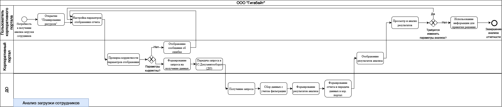
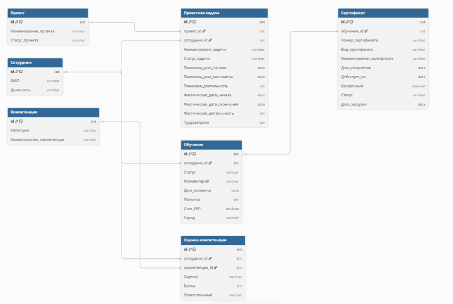

# Оптимизация подсистемы «Отчетность и аналитика» (ООО «Гигабайт»)

## О проекте
**Роль:** Младший системный аналитик (Практика)
**Цель:** Оптимизация бизнес-процессов формирования отчетности и разработка функциональных требований для обновления корпоративного портала на базе 1С.

## Выполненные задачи
1. Аудит текущих процессов: моделирование 6 процессов **AS-IS** в нотации **BPMN**.
2. Разработка целевой архитектуры **TO-BE**: проектирование автоматической валидации запросов через «1С:Документооборот».
3. Сбор и формализация требований для 6 аналитических дашбордов.
4. Проектирование логической модели базы данных (**ERD**) с использованием DBML.

## Ключевые артефакты

### 1. Моделирование процессов (BPMN TO-BE)
Оптимизированный процесс анализа загрузки сотрудников с предварительной проверкой параметров.

### 2. Структура Базы Данных (ER-модель)
Спроектирована база данных, включающая 7 ключевых бизнес-сущностей (Сотрудник, Проект, Обучение, Сертификат и др.).

### 3. Функциональные требования
Фрагмент формализованных требований к дашборду «Анализ загрузки сотрудников»:
* **Входные параметры:** Исполнитель, проект, руководитель, статус задач.
* **Отображаемые метрики:** Запланированное время, остаток по задаче, количество активных проектов.
* **Ограничения:** Автоматическая проверка корректности параметров до отправки запроса в 1С.

## 🏆 Результат
Подготовлен концепт для разработки подсистемы. Предложенные BPMN-модели и структура БД минимизируют количество ошибок ввода и снижают нагрузку на серверную часть за счет первичной валидации на стороне портала.
