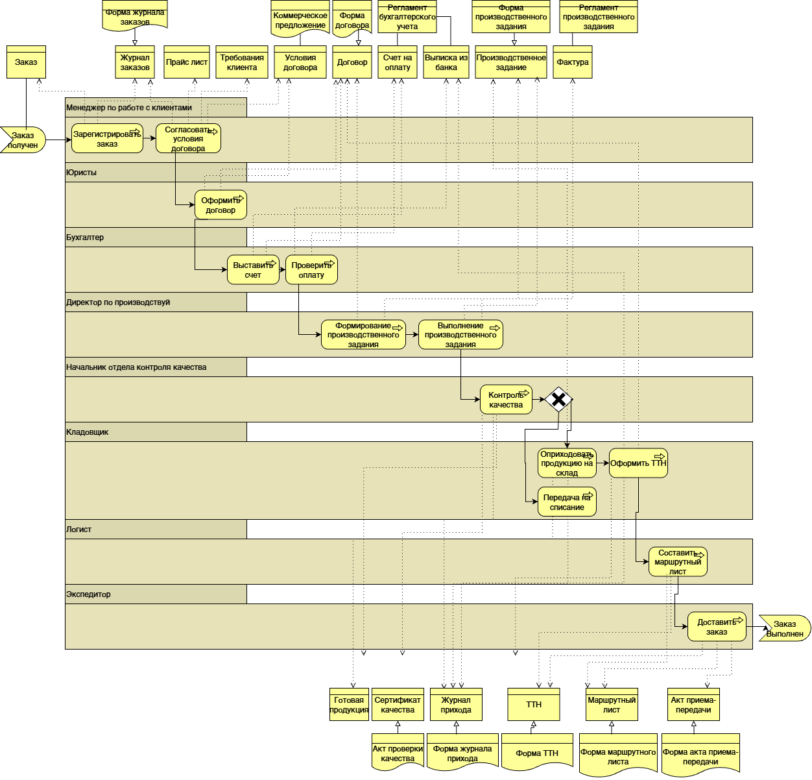
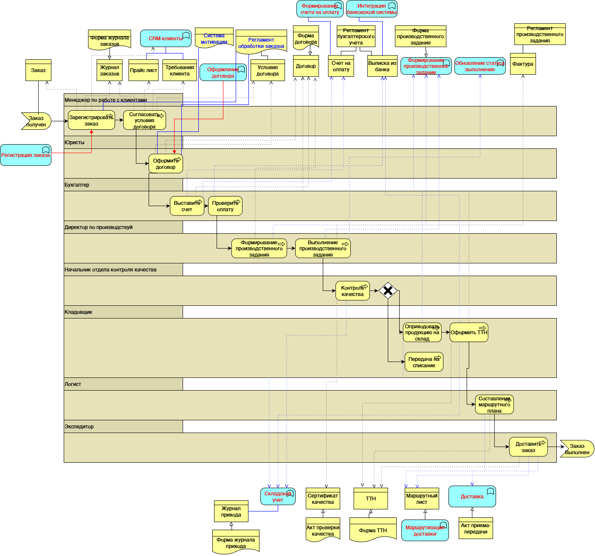
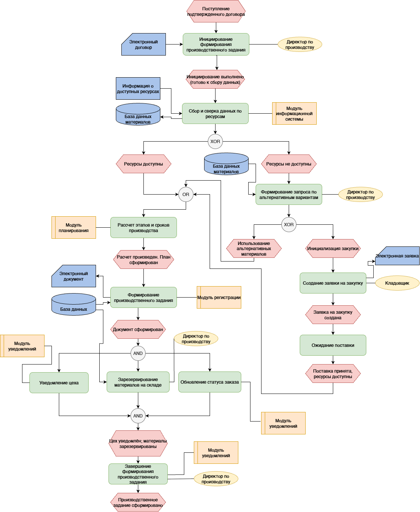
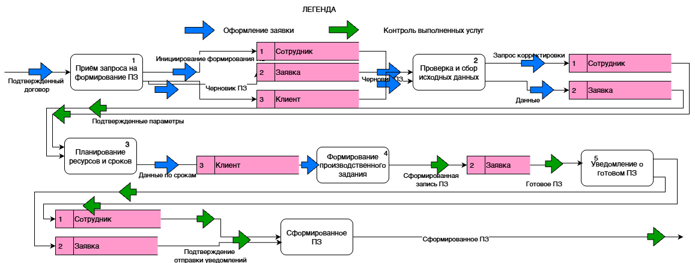
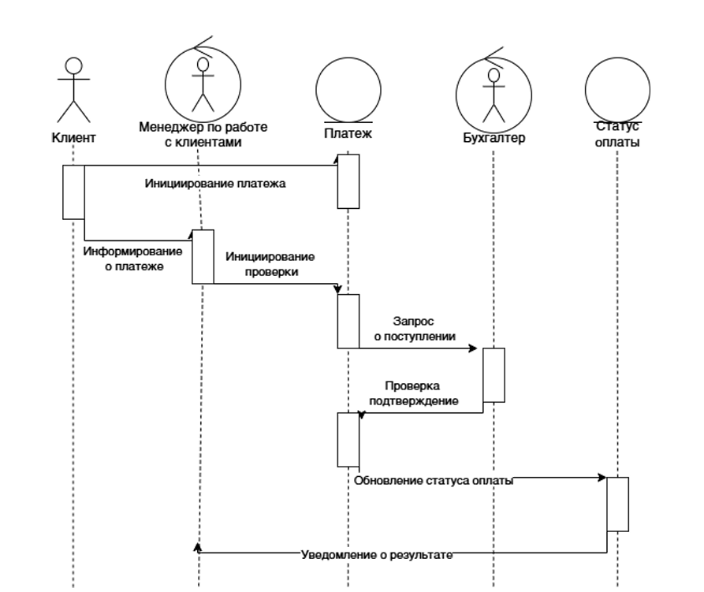
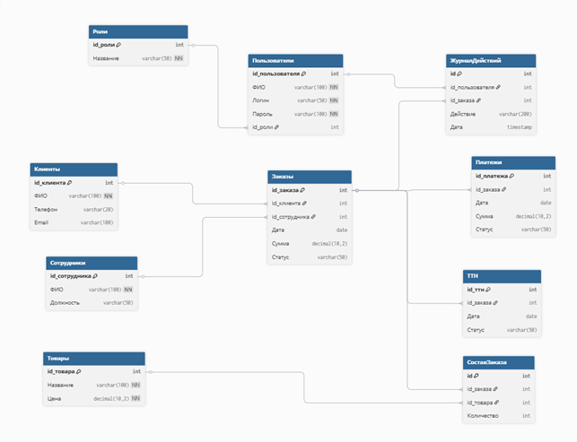
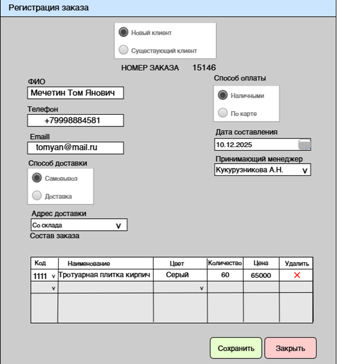
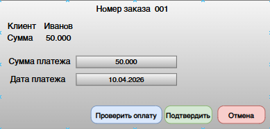
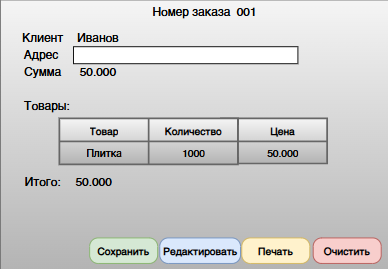

# Проект 2: Комплексное проектирование информационной системы производственного предприятия

**Предприятие:** ООО «ТротуарПро»  
**Период реализации:** Октябрь 2025 - май 2026  

**Роль:** Бизнес-аналитик / Системный аналитик  
**Цель проекта:** Комплексное проектирование корпоративной информационной системы - от выявления узких мест в ручных бизнес-процессах до разработки ИТ-архитектуры, реляционных баз данных и макетов интерфейсов. Главная задача - спроектировать решение, которое свяжет разрозненные этапы (продажи, производство, финансы и логистику) в единый прозрачный и автоматизированный сквозной процесс.

---

## 1. Контекст проекта и оргструктура
Проект посвящен комплексному системному проектированию информационной системы (ИС) для предприятия ООО «ТротуарПро», специализирующегося на производстве бетонных изделий. Целью работы было не просто автоматизировать отдельную операцию, а спроектировать сквозную логику взаимодействия подразделений, охватывающую работу с заказами, производство, оплату и логистику.
Для понимания зон ответственности я предварительно изучила [организационно-функциональную структуру](./2assets/org.png) предприятия.

---

## 2. Бизнес-анализ и выявление проблем (От AS-IS к TO-BE)
Для формализации текущего состояния я разработала модель AS-IS.
Модель позволила визуализировать взаимодействие подразделений и определить, на каких этапах возникают ручные операции, передача информации и потенциальные ошибки.

  
**Модель AS-IS**

На основании результатов анализа была сформирована таблица проблем и предложений по совершенствованию.
**[Подробные таблицы бизнес-анализа, матрицы проблем и системных событий](./documentation/tables.md#table).**
После этого я разработала целевую модель TO-BE, в которой ручные операции были заменены или дополнены функциями информационной системы.

  
**Модель TO-BE**

В результате в целевой модели было выделено 10 потенциальных функций для автоматизации.

Для детального системного проектирования я выбрала **4 наиболее значимые функции**:
1. Регистрация заказа
2. Формирование производственного задания (ПЗ)
3. Проверка оплаты
4. Оформление ТТН (товарно-транспортной накладной)

**Почему были выбраны именно эти функции?**
Выбор обусловлен их неразрывной связью в едином сквозном процессе предприятия. Эти четыре этапа покрывают полный жизненный цикл заказа: от первого касания клиента (Продажи) -> передачи в цех (Производство) -> контроля финансов (Бухгалтерия) -> до финальной отгрузки (Логистика). Автоматизация этой цепочки устраняет главную проблему компании — разрыв информационного потока между подразделениями.

---

## 3. Структурный анализ (Производство и Продажи)
Для функций **«Регистрация заказа»** и **«Формирование ПЗ»** я использовала структурный подход, включающий работу с документами, событийной логикой (EPC) и потоками данных (DFD).

### Проектирование первичных документов
Прежде чем выстраивать системные алгоритмы, я разработала унифицированные формы первичных документов — **[Карточку заказа и Производственное задание](./documentation/tables.md#document)**. Это позволило стандартизировать состав передаваемых данных (информация о клиенте, номенклатура, сроки, ответственные лица), устранить разночтения между менеджерами и цехом, а также заложить основу для будущей базы данных и экранных интерфейсов.

### Событийная логика (EPC)
Для формализации алгоритмов работы системы я спроектировала модели EPC (Event-Driven Process Chain). 
Например, в процессе *регистрации заказа* система проводит автоматическую проверку данных, создает запись в БД и генерирует электронный документ.  
В процессе *формирования производственного задания* ключевым моментом стало внедрение автоматической проверки обеспеченности материалами: с помощью XOR-разветвления система решает, можно ли отправить ПЗ в цех, или необходимо сначала сформировать заявку на закупку сырья.

  
**EPC-диаграмма "Формирование производственного задания"**

### Потоки данных (DFD)
Для анализа того, как информация из документов циркулирует внутри системы, я построила **7+ DFD-диаграмм**. Они описывают источники данных, процессы обработки, хранилища и внешние сущности. Декомпозиция процессов позволила четко выделить системные транзакции (основные и обеспечивающие), что в дальнейшем заложило основу для проектирования архитектуры системы.

**DFD-Diagram "Формирование производственного задания"**

---

## 4. Объектно-ориентированный анализ UML (Финансы и Логистика)
Для функций **«Проверка оплаты»** и **«Оформление ТТН»** я применила инструментарий UML. 

Для описания взаимодействия пользователей (Менеджера, Бухгалтера, Кладовщика) с системой были разработаны:
* [Диаграммы деятельности (Activity)](./2assets/ddeyatel.png): визуализированы алгоритмы проверки поступления средств и оформления отгрузки.
* [Диаграммы бизнес-объектов для бизнес-прецедента проверки оплаты](./2assets/dbodbp.png) 
* **Диаграммы последовательностей (Sequence):** детально описан порядок вызовов и передачи данных между актерами, интерфейсами системы (Окно проверки/Оформления) и контроллерами на оси времени.

**"Диаграмма последовательности функции "Проверка оплаты"**
  

---

## 5. Моделирование данных (ER-модели)
Вся спроектированная логика опирается на единую реляционную структуру данных. Для 4-х выбранных функций были спроектированы **две логические ER-модели**, объединяющие 8 нормализованных сущностей.

1. **Модель 1 (Продажи и Производство):** Отражает взаимосвязь между функциями *Регистрации заказа* и *Формирования ПЗ*. Включает сущности: Заказ, Состав заказа, Товары, Сотрудники, Производственное задание.
3. **Модель 2 (Финансы и Логистика):** Отражает взаимосвязь между *Проверкой оплаты* и *Оформлением ТТН*.

**ER-модель функций "Проверка оплаты" и "Оформление ТТН"**
  

Такое концептуальное разделение позволило детально проработать две предметные области, сохранив при этом единые ключи для их последующего слияния в общей базе данных предприятия.

---

## 6. Проектирование пользовательского интерфейса (UI)
На основании разработанных Use Case и системных сценариев я спроектировала макеты интерфейсов для всех четырех автоматизируемых функций. Интерфейсы продуманы с точки зрения минимизации ручного ввода и снижения ошибок.

<table align="center">
  <tr>
    <td align="center" valign="top"><b>1. Регистрация заказа</b> </td>
    <td align="center"><b>2. Формирование ПЗ</b> </td>
  </tr>
  <tr>
    <td align="center" valign="top"><b>3. Проверка оплаты</b> </td>
    <td align="center"><b>4. Оформление ТТН</b> </td>
  </tr>
</table>

---

## 7. Выводы и результаты работы

Основной задачей проекта было перевести разрозненные, ручные бизнес-процессы предприятия в формализованную, готовую к разработке модель информационной системы. 

В результате моей работы как системного аналитика:
* Проведен аудит предприятия, выявлено **более 10 узких мест** в текущих процессах.
* Разработаны модели процессов **AS-IS** и **TO-BE**.
* Спроектирована архитектура для **4-х сквозных бизнес-функций** с использованием нотаций EPC, DFD и UML.
* Спроектированы реляционные базы данных (**2 ER-модели**) и **более 4-х UI-макета** интерфейсов.

Спроектированная концепция системы решает главные проблемы компании, описанные в таблице ниже. Предполагаемый эффект от внедрения разработанной архитектуры — **сокращение ручных операций и дублирования данных примерно на 40%**.

| Исходная проблема (AS-IS) | Решение в спроектированной системе (TO-BE) | Ожидаемый бизнес-эффект |
| :--- | :--- | :--- |
| **Ручная регистрация заказов** (передача бумажных заявок между отделами) | Единая форма электронной регистрации заказов с записью в центральную БД. | Снижение времени обработки заявки, исключение потери документов. |
| **Неконтролируемое производство** (выдача заданий без проверки склада) | Автоматическая проверка обеспеченности сырьем (XOR-логика) до отправки ПЗ в цех. | Ликвидация простоев цеха из-за нехватки материалов. |
| **Отсутствие контроля оплат** (бухгалтер ищет платежи вручную) | Системный сценарий (Use Case) автоматической проверки статуса оплаты с привязкой к заказу. | Прозрачность финансового этапа, отгрузка только оплаченных товаров. |
| **Повторный ввод данных при логистике** | Автогенерация накладных (ТТН) на основе уже имеющихся в БД данных заказа. | Устранение дублирования работы, минимизация ошибок при отгрузке. |

Ценность данного проекта заключается в системном подходе, в котором каждый этап проектирования (интерфейсы, базы данных, UML-логика) строго опирается на предварительно проведенный бизнес-анализ и выявленные потребности предприятия.
