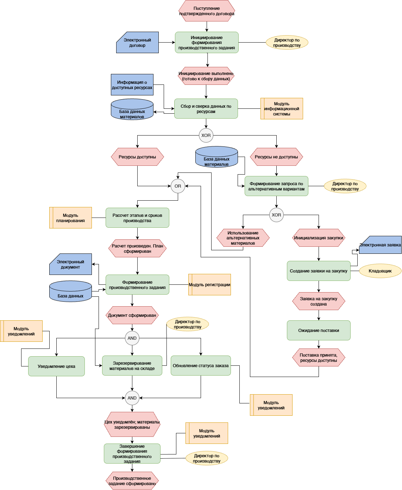
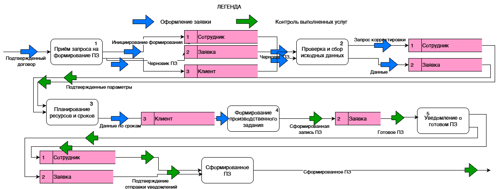
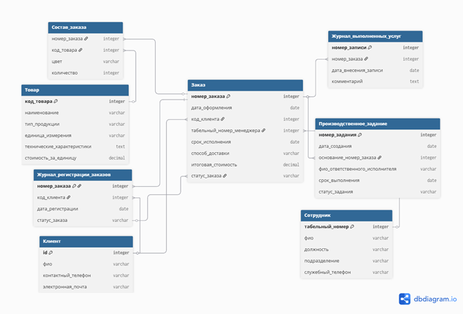
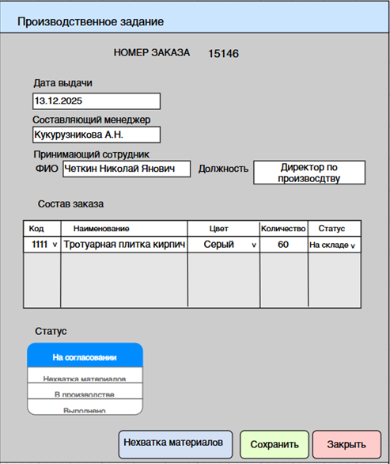

# Проектирование ИС управления производством (ООО «ТротуарПро»)

## О проекте
**Роль:** Системный аналитик
**Цель:** Автоматизация ручного делопроизводства предприятия, создание единой среды для регистрации заказов и формирования производственных заданий.

## Задачи и инструменты
* Построение функциональной модели и DFD-диаграмм.
* Моделирование бизнес-процессов в нотации **EPC**.
* Проектирование концептуальной модели данных **ERD**.
* Разработка макетов UI.

## Ключевые артефакты

### 1. Анализ текущего процесса (BPMN AS-IS)
Проанализирован текущий процесс обработки заказов и передачи производственных заданий. Выявлены ручные операции при регистрации и передаче информации между ответственными сотрудниками, а также риски потери или дублирования данных.

### 2. Архитектура бизнес-процессов (EPC TO-BE)
Спроектирована целевая модель регистрации заказов, сокращающая ручной труд.

### 3. Декомпозиция потоков данных (DFD)
Описана логика передачи данных между модулями информационной системы.

### 4. Модель базы данных (ERD)
Спроектирована структура БД (7 сущностей, нормализация до 3НФ).

### 5. Прототип пользовательского интерфейса
Разработаны экранные формы для работы менеджеров.

## Результат
Подготовлен комплект аналитической и проектной документации для дальнейшей разработки информационной системы: модели AS-IS / TO-BE, EPC и DFD, модель данных ERD, требования и прототипы пользовательского интерфейса.

Целевая модель процесса сокращает количество ручных операций и снижает риск потери или дублирования данных при передаче информации между ответственными сотрудниками.
