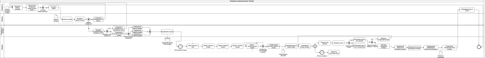
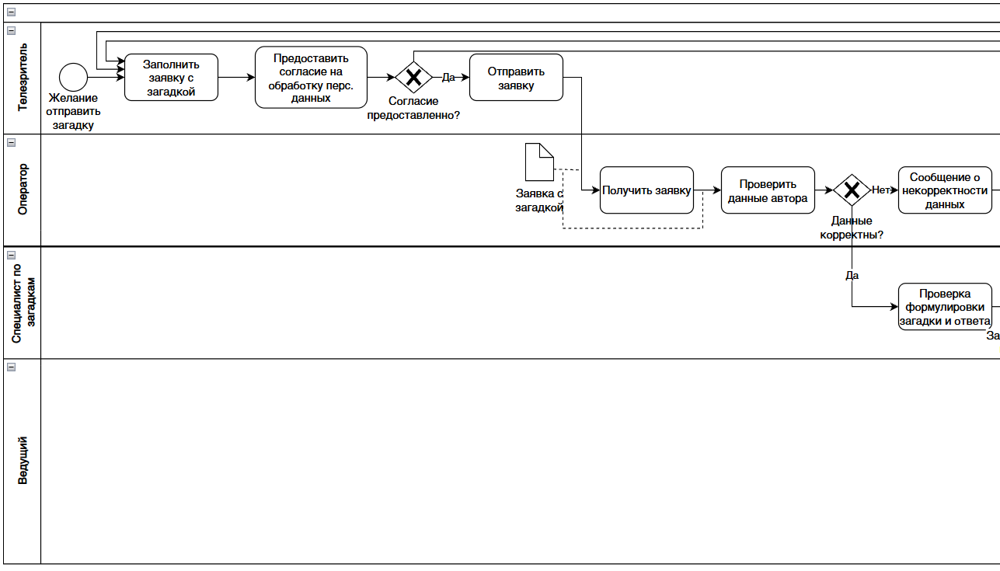
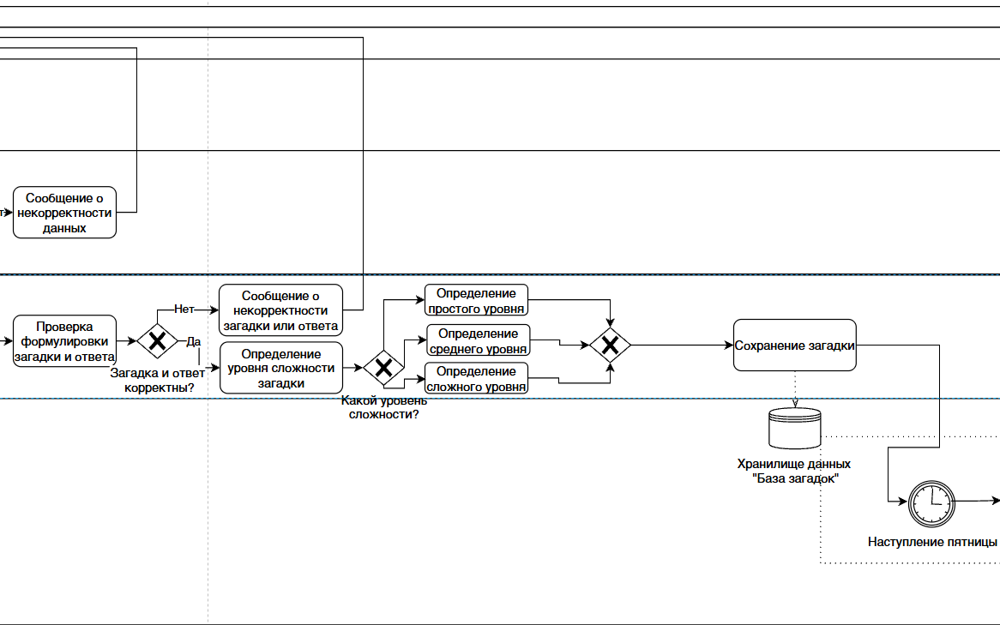
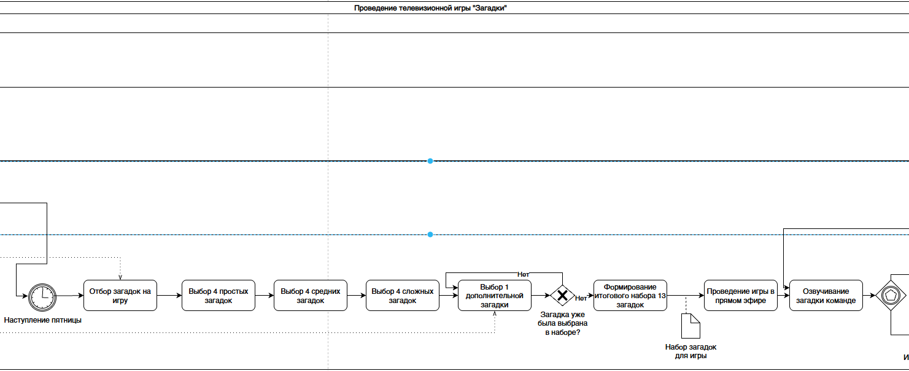
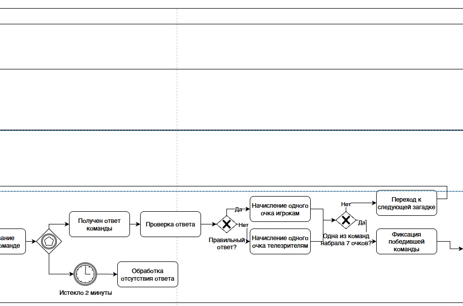
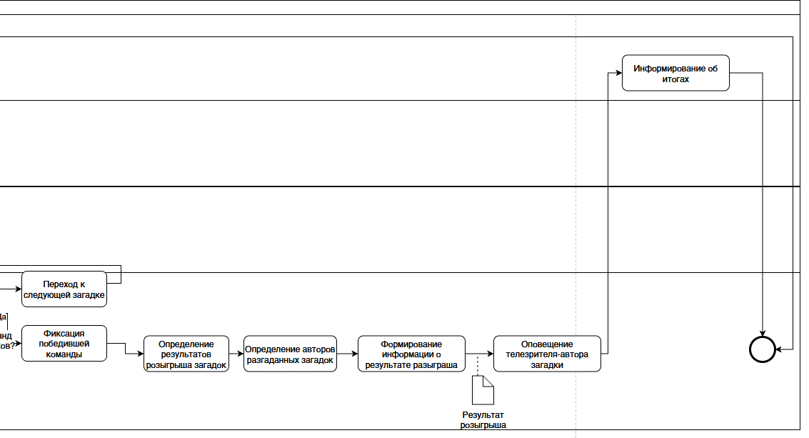

# Детальная BPMN-модель процесса: Телеигра «Мир загадок»

⬅️ **[Вернуться к описанию архитектуры системы](./tv_show_system.md)**

В данном документе представлена декомпозиция сквозного бизнес-процесса телевизионной игры. Модель разделена на логические блоки для удобства чтения и передачи в разработку.

---

## Общая схема процесса
Верхнеуровневая модель, отражающая полный жизненный цикл контента: от отправки загадки телезрителем до рассылки результатов после прямого эфира.

  
**Общая схема BPMN**  
 

 

---

## Декомпозиция по этапами

### 1. Прием и первичная проверка заявки
**Участники:** Телезритель, Оператор.  
**Суть этапа:** Телезритель регистрируется, дает согласие на обработку ПД и отправляет загадку. Оператор выступает в роли "спам-фильтра", проверяя корректность контактных данных автора. При ошибке телезритель получает уведомление.

  
**Фрагмент BPMN-модели: прием и первичная проверка заявки**  
 

---

### 2. Проверка и классификация контента
**Участники:** Специалист по загадкам, Система (База данных).  
**Суть этапа:** Профильный специалист проверяет корректность формулировки и логику ответа. Главная задача на этом этапе — с помощью системы классифицировать загадку по уровню сложности (Простая / Средняя / Сложная). После классификации загадка сохраняется в общую Базу данных.

  
**Фрагмент BPMN-модели: проверка и классификация загадки**  
 

---

### 3. Отбор загадок для игры (Генерация плейлиста)
**Участники:** Система (по таймеру/триггеру наступления пятницы).  
**Суть этапа:** Наступление времени эфира инициирует алгоритмический отбор. Система обращается к БД и собирает квоту: 4 простых, 4 средних, 4 сложных и 1 дополнительную загадку. Выбранные загадки формируются в итоговый набор для передачи ведущему.

  
**Фрагмент BPMN-модели: отбор загадок для игры**  
 

---

### 4. Проведение игры и фиксация результатов
**Участники:** Ведущий.  
**Суть этапа:** Работа в прямом эфире. Запускается 2-минутный таймер на обсуждение. Ведущий проверяет ответ команды. В зависимости от правильности ответа (XOR-шлюз), система начисляет очко либо игрокам, либо телезрителю. Процесс зацикливается до момента, пока одна из сторон не наберет 7 очков.

  
**Фрагмент BPMN-модели: проведение игры**  
 

---

### 5. Оповещение авторов
**Участники:** Система.  
**Суть этапа:** После фиксации команды-победителя, система определяет авторов разыгранных загадок, формирует результаты выигрыша/проигрыша и осуществляет рассылку уведомлений телезрителям.

  
**Фрагмент BPMN-модели: оповещение авторов загадок**  
 

---
⬅️ **[Вернуться к описанию архитектуры системы](./tv_show_system.md)**
