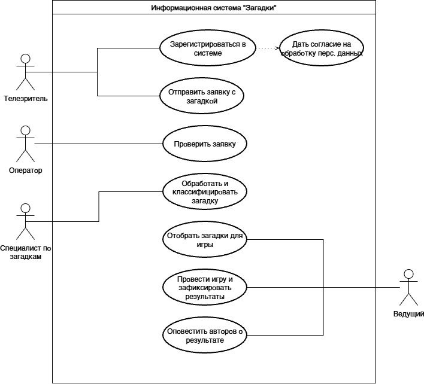
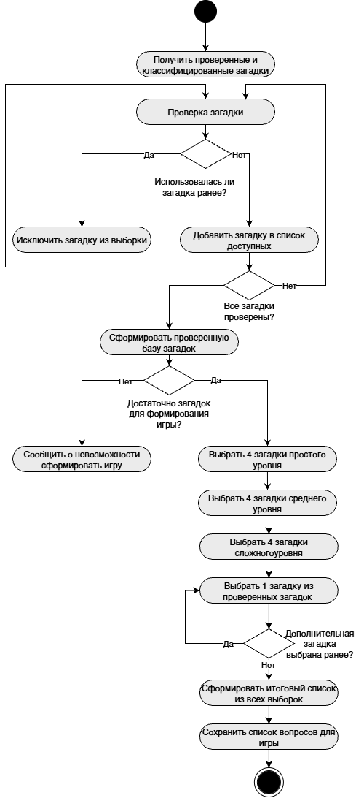

# Кейс 2: Проектирование ИТ-систему для телешоу «Мир загадок»

⬅️ **[Вернуться к списку кейсов](./README.md)**

## Бизнес-контекст
**Предприятие:** Телевизионная компания.  
**Задача:** Выполнить системное проектирование платформы для сопровождения телевизионной игры «Загадки» в прямом эфире. 
**Бизнес-логика:** Зрители присылают загадки. Модераторы делят их на 3 уровня сложности. Для эфира по жестким квотам отбирается ровно 13 загадок (4 простых, 4 средних, 4 сложных, 1 случайная). Во время игры фиксируется счет, а после эфира система автоматически рассылает результаты авторам.

---

## 1. Сквозной процесс (BPMN)
Для того чтобы превратить правила телеигры в ИТ-продукт, мне нужно было формализовать весь жизненный цикл заявки — от зрителя до прямого эфира.

Для этого я спроектировала верхнеуровневую модель в нотации **BPMN**, разделив процесс на пулы по зонам ответственности:
1. Прием заявки (Зритель).
2. Классификация и модерация (Специалист).
3. Алгоритмический отбор 13 загадок.
4. Проведение игры и нотификация (Ведущий).

  
**Фрагмент BPMN-модели: прием и первичная проверка заявки**  
 

 

**[Для более детального ознакомления модели BPMN](./documentation.md)**

---

## 2. Границы системы и роли (UML Use Case)
Имея перед глазами весь бизнес-процесс (BPMN), я перешла к проектированию самой системы: нужно было определить, какие именно функции будут доступны разным участникам шоу.

Я разработала диаграмму прецедентов (**Use Case**), жестко разграничив права:
* **Телезритель:** регистрируется в системе и отправляет заявку с загадкой.
* **Оператор:** только валидирует контакты.
* **Специалист:** оценивает сложность и сохраняет в БД.
* **Ведущий:** инициирует алгоритм отбора для эфира и запускает рассылку.

  
**Use Case диаграмма**  

 

---

## 3. Алгоритм генерации загадок (UML Activity)
Определив, что функция «Отобрать загадки для игры» принадлежит Ведущему, я детализировала логику системы — как именно софт должен собирать этот плейлист по нажатию одной кнопки.

С помощью диаграммы деятельности (**Activity Diagram**) я визуализировала алгоритм: система фильтрует базу "несыгранных" загадок, делает случайную выборку по заданным квотам (4+4+4+1), проверяет валидность сборки и блокирует выбранные загадки от попадания в следующие эфиры.

  
**Activity диаграмма**  

 

---

## 4. Логическая модель данных (ER)
Для того чтобы описанный выше алгоритм мог работать, системе необходимо где-то хранить сами загадки, их уровни сложности и историю эфиров. 

Для этого я спроектировала логическую структуру реляционной базы данных (**ER-модель**). 
Центральной транзакционной сущностью выступает `Розыгрыш`, связывающий конкретную `Игру` (эфир) с `Загадкой` и фиксирующий статус победителя, что позволяет системе вести статистику и не допускать повторов контента в будущих передачах.

  
**ER Модель**  

 

---

## 5. Нефункциональные требования  
Архитектура данных и алгоритмы готовы, но система должна работать в условиях **прямого телевизионного эфира**, где любая задержка или падение серверов критичны.

Поэтому финальным этапом я зафиксировала технические лимиты для будущей инфраструктуры:
1. **отклик:** время выполнения операций ведущим (генерация списка, сохранение результатов) не должно превышать **3 секунд**.
2. **нагрузка:** бэкенд должен выдерживать потоковую обработку от 1 000 заявок от телезрителей и работу 100 пользователей одновременно без деградации времени отклика.

---

## Итоги и перспективы проекта
**Ценность проведенной работы:**
В этом кейсе я перевела развлекательный телевизионный формат в строгую ИТ-архитектуру. Правила игры стали программными алгоритмами, а сценарий эфира — структурой базы данных.

**дальнешее использвоание:**
* Модели BPMN и Use Case — это готовая база для **UX/UI-дизайнеров** (для отрисовки интерфейсов модераторов и пульта Ведущего) и написания **ТЗ (SRS)**.
* Алгоритм выборки (Activity Diagram) и ER-модель передаются **Backend-разработчикам** для написания логики случайной генерации эфира и проектирования БД.
* NFRs (требования к нагрузке) являются руководством для **DevOps-инженеров** при расчете мощностей серверов под прямой эфир.

⬅️ **[Вернуться к списку кейсов](./README.md)**
