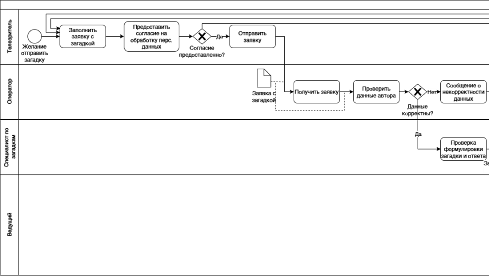
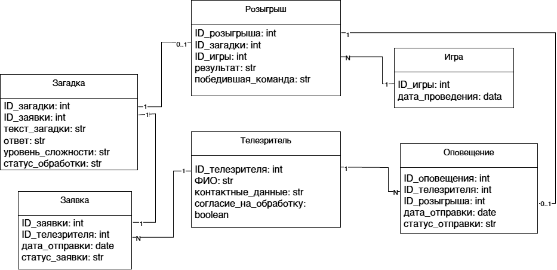

# Прикладные задачи системного анализа: UML и Проектирование алгоритмов

В данном разделе представлены решения прикладных бизнес-кейсов, демонстрирующие навыки анализа требований, моделирования бизнес-процессов и взаимодействия пользователей с информационными системами, разработки UML-моделей, проектирования алгоритмов и формулирования нефункциональных требований.

---

## Кейс 1: Информационная система ТВ-шоу «Мир загадок»

### Суть задачи
Спроектировать систему для приёма и обработки заявок с загадками от телезрителей, их проверки и классификации по уровню сложности, отбора загадок для прямого эфира и оповещения авторов о результатах розыгрыша.

### 1. Модель ролей и вариантов использования (UML Use Case)
Описаны ключевые акторы (телезритель, оператор, специалист по загадкам, ведущий). Для каждой роли определены основные функции и цели взаимодействия с системой.

### 2. Модель процесса (BPMN)
Разработан BPMN-процесс обработки заявки: от её отправки телезрителем до классификации загадки, отбора для игры и фиксации результата. В модели отражены взаимодействие ролей, проверки корректности данных и альтернативные сценарии обработки.

### 3. Алгоритм отбора заявок (UML Activity)
Спроектирована логика принятия решений (ветвления, циклы) при отборе загадок по уровню сложности.

### 4. Нефункциональные требования (NFRs)
* **Производительность:** Время отклика системы при обработке заявок не должно превышать 3 секунд при штатной нагрузке.
* **Доступность:** Поддержка одновременной работы не менее 100 пользователей и обработка до 1 000 заявок без деградации времени отклика.
* **Безопасность:** Разграничение прав доступа и запрет на выполнение операций, не предусмотренных ролевой моделью.

### 5. Логическая модель данных (ERD)
Выделены основные сущности предметной области, определены их ключевые атрибуты и связи. Модель отражает взаимосвязи между телезрителями, заявками, загадками, играми и результатами их розыгрыша.

## Результат
Разработан комплект аналитических моделей, описывающий роли пользователей, процессы системы, структуру данных и алгоритм отбора загадок для игры.
---

## Кейс 2: Система безопасной корпоративной печати

### Суть задачи
Решить проблему утечки конфиденциальной информации при использовании общего офисного принтера без изменения аппаратной части и физического расположения принтера.

### 1. Уточнение требований
Сформирован перечень вопросов для выявления неоднозначностей и определения требований к новому программному обеспечению.
Рассмотрены вопросы:
* определения конфиденциальности документа;
* круга сотрудников, имеющих право на получение документа;
* идентификации сотрудника;
* работы очереди печати;
* фиксации действий с конфиденциальными документами;
* обработки документов, которые не были получены в установленный срок.

### 2. Анализ вариантов решения
Проведено сравнение трёх вариантов ограничения доступа:
* подтверждение личности с помощью корпоративных средств идентификации;
* получение документа по PIN-коду;
* подтверждение получения через корпоративное приложение.

Для каждого варианта определены достоинства, недостатки и условия, при которых он является предпочтительным.

### 3. Выбранное решение: печать по PIN-коду
Выбран вариант с PIN-кодом, поскольку он позволяет реализовать программное ограничение доступа без изменения аппаратной части принтера и использования дополнительных средств идентификации.

**Алгоритм печати документа (фрагмент):**
1. Пользователь отправляет документ на печать со своего ПК, задавая уникальный PIN-код.
2. Система помещает документ в очередь (Hold-режим) без физической печати.
3. Пользователь подходит к принтеру, находит задание по имени и вводит PIN-код.
4. При совпадении PIN-кода система инициирует печать.
5. При ошибке ввода документ блокируется/удаляется из очереди по истечении таймаута.

## Результат
Разработано концептуальное решение для ограничения доступа к конфиденциальным распечатанным документам с учётом требований безопасности, пользовательских сценариев и ограничений исходной задачи.
